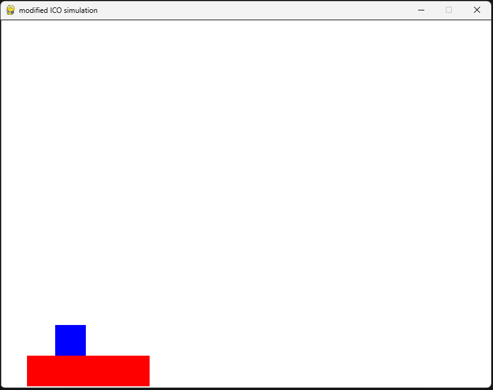
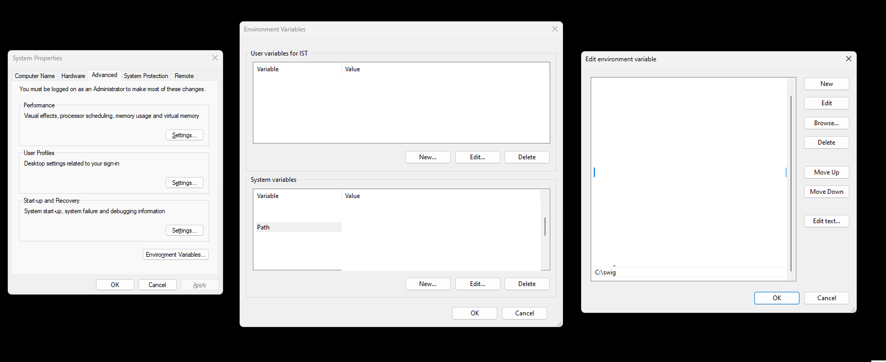
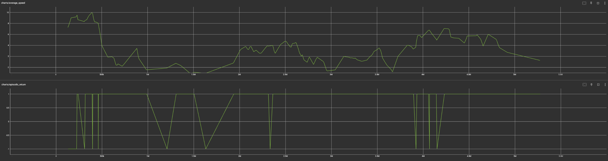
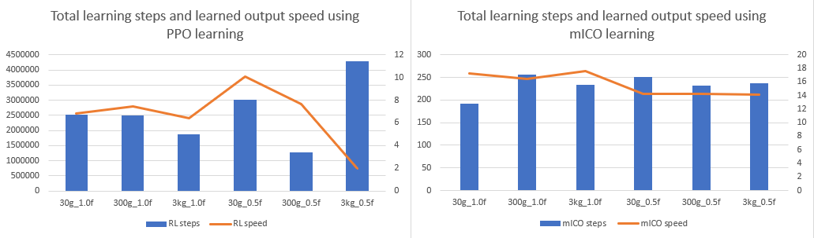
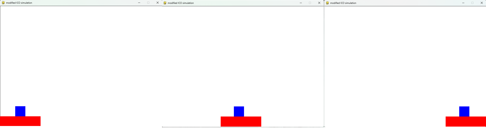
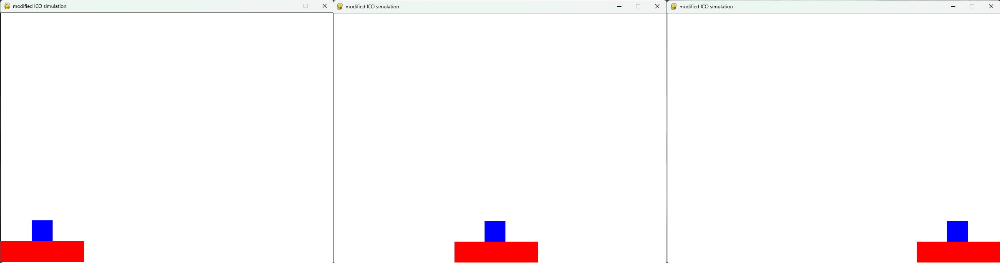
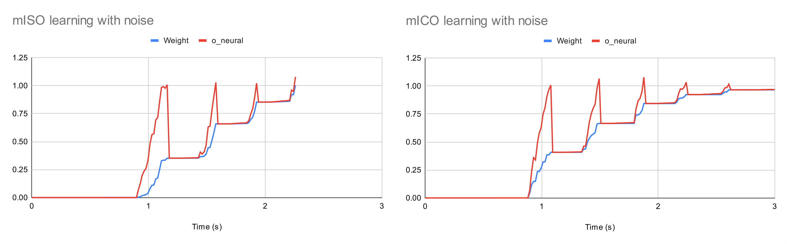

# Visual-Based Adpative Interaction System 

This is a source code of Visual-Based Adaptive Interaction System (VAIS) using visual information and a fast neural learning mechanism called modified Input Correlation-Based Learning (mICO) to improve a service delivery on a mobile service robot (MOVO).

---

# Requirement

1. Ubuntu 16.04 with ROS Kinectic
2. ROS Alvar

---

# Framework

This framework is divided into four sub-components:

1. Visual Perception: ROS Alvar package was utilized to obtain a pose-estimation of the object with the attached AR tag (QR marker provided by the delivers).
2. Signal Generator: A conversion of object's pose-estimation to the input signals using normalization of the Euclidean Distance between reference point and current position.
3. MICO: A fast modified neural network that adapt the robot behavior (speed) based on the relationship between the input signals.
4. Output Conversion: The conversion of neural output to the robot's speed output.

# Structure
This source code is based on ROS-Python containing:

1. delivery_sim: This folder contains a 2D simulator which is a simplify version of the delivery service comparing with RL and mISO.
2. launch: This launch folder contains files which is used to execute ROS package via ```roslaunch``` command.
3. script: This script folder contains necessary files that called methods from src folder which executed in roslaunch.
4. msg: This is a folder which stored a custom message file.
5. src: This folder contain a main source code. In this folder, the source code contains 6 sub-folders:

- ICO: This folder is where the learning modules are stored. It contains signal generator, mICO learning, and data management to store/load the learning weight. The output of this module is a neural output (o_neural) which is used in an output method.
- demo: A demo source code which performed a combination of both translational and rotational motions in a controlled environment.
- menu: This is a main menu where the user can choose to operate the script with a default paramters or enter the manual values for the learning mechanism.
- output: This output folder receives the neural output from the mICO module, and convert it into the robot's output speed (o_speed). Noted that this module is specifically to a MOVO module. In case of the other robot, user need to rewrite this code to operate on that robot.
- posture: This is only used for a MOVO to adjust it into a specific posture.
- test: A test folder which copied some script from MOVO package to test some MOVO specific components.


# Execution

1. Start a camera node by ```roslaunch vais camera.launch```.
2. Start an alvar node by ```roslaunch vais alvar.launch```.
3. Start a VAIS node by ```roslaunch vais vais.launch```.
4. Follow the instruction on ```ICO_menu.py``` command line.

# Customization

To customize the learning framework, user can adjust these components under the ```vais/src/menu/ICO_menu.py``` in a default_value method:

1. Distance threshold: User can manually set exemption threshold (e_object), predictive threshold (p_object), and reflexive treshold (r_object) in centimeter unit.
2. Learning rate: Learning rate of the MICO.
3. State: This parameter can be set as a robot's movement. 'Linear' (Linear translation movement) or 'Angular' (Angular rotation movement).
4. Alvar tag ID: The number of the ar_id tag that use to track the object.
5. Goal: This is where the robot stop its movement (i.e., finishing line). goal_x is a linear translation movement (in meters) and goal_z is an angular rotation movement (in degrees).

However, if the user has the other robot, user need to change the direction of the topics described below:

1. User can create a new camera launch file and edit the ```alvar.launch``` file on "cam_image_topic", "cam_info_topic", "output_frame" to the robot you are working on.

2. Create or edit the ```vais/src/output/base_output.py``` to subscribe and publish these topics according to your robot.

# Note
In this source code, the folder ICO is the modified Input Correlation-Based Learning (mICO) corresponding to the paper.

---

# Delivery simulator



This delivery simulator is a simplified version in 2D using Pygame and Box2D-python as the physics and game engine. The objective of the simulation is to transport the object (blue square) which is placed on top of the tray (red rectangle) from the bottom-left of the screen to the bottom-right of the screen.

---

# Requirement
1. CUDA (for Reinforcement Learning)
2. Anaconda (with Python 3.8 environment)
3. Gym ```pip install gym```
4. Tensorflow ```pip install tensorflow```
5. Pytorch ```pip install torch``` 
5. Pygame ```pip install pygame```
6. Swig 
* Ubuntu: ```pip install swig```
* Windows: Download [swig](https://www.swig.org/download.html), extract, and edit windows environment variable inside Path section

7. Box2D ```pip install box2d box2d-kengz```

---

# Execution
To execute the simulation just use ```python "filename".py``` where filename is the file you want to run. For mICO, the learning process is automatic and the log is saved in ```\data\"fileoutput".py``` where "fileoutput" is set in the code.

# Environment Template
This template is an environment setup without any learning where user can manually control the tray (red rectangle) with these buttons:

* Left arrow: move to the left
* Right arrow: move to the right
* Down arrow: stop
* r button: reset to an initial position

During the simulation, the position and velocity of both objects will be printed out to the screen.

# Customization

To customize the environment properties, you can browse to the list below:

* gravity: The simulation is normally set to 9.81

* PPM: This is a Pixel Per Meter unit where we can map the distance between the output screen (pixel unit) and the real world (meter). The example below means that it takes 200 pixel in the screen as 1 meter in the real world.

* rect_width, rect_height: width and height of the tray in meter * PPM.

* rect_position: an initial position of the tray, normally it is set to the bottom left of the screen.

* rect_mass: Tray weight in kg unit

* rect_density: The density is calculated from mass*area (in 2D) if the rect_width, height is changed this part has to change too.

* rect_friction: change tray friction

* square_width, square_height: width and height of the square in meter * PPM.

* square_position: an initial position of the square, normally it is set on top at the middle of the tray.

* square_mass: Tray weight in kg unit

* square_density: The density is calculated from mass*area (in 2D) if the square_width, height is changed this part has to change too.

* square_friction: change object friction

**Note that the Box2D and Pygame has different y-axis where Pygame use the y-down direction and Box2D use the y-up direct. When you implement the other object beside this, keep that in mind that you have to calibrate the Pygame drawing position to match the Box2D object position.**

---

# mICO part

# Template
This template includes the modified Input Correlation-Based Learning (mICO), the neural network to automatically learn and adjust the speed via the change of the object (In this case, we use the difference between current position of the object (square) and reference postion of the tray (rectangle)). The goal is to find the optimal speed to deliver the object while the object staying in the acceptable area. The learning is divided into parts below:

## Signal generator
The signal generator is used to transform the position of the object into signals. In this simulation, we only use deviation of position on the x-axis between object (**square_pos.x**) and the tray (**rect_pos.x**) two creates three signals based on thee threshold:

* Exemption threshold (et): this threshold allows the object to move freely within this range without triggering anything. It is used to cover the minor deviation from external disturbance in real world.

* Predictive threshold (pt): this threshold is the further area where it generates the predictive signal for the tray.

* Reflexive threshold (rt): this threshold is a last area where it generate the reflexive signal.

* SO: signal of the object detection; it is active (as constant of 1) if the object stays inside the learning area. Otherwise, 0.

* SP: predictive signal; the prior signal use to signal the tray that it should slow itself down. In this state, the learning mechanism still inactive.

* SR: reflexive signal; the later signal use to signal the tray that it must slow itself down. In this state the learning mechanism become active and adapt its speed to the possible optimal point.


As mentioned earlier, we use the difference of x_position comparing to the treshold to create the signals with a normalization between 0, 1.

However, you can modify the threshold of the signal in the code:

``` 
et = 10
pt = 30
rt = 70
```

## learning mechanism
After retrieving those three signals, it can be used in the mICO learning in two parts:

* nueral output: the output is a by-product from the signals with their signal weights and constant factor.
* weight update: the learning rule to update the activation weight (weight that shape the behavior of the robot to avoid the unwanted consequence behavior)

In this part the user can modify the constant factor and learning rate in the code:

```
    # Constant factor
    co = 1
    cp = 0.01
```
```
    # This learning rate has to be adjusted in case    that the weight reaches 1 too fast.
    l_rate = 0.01
```

## Output 
This section is the part where neural output is used as the threshold to scale with the tray output.

## Logs
mICO log can be found at \data folder in form of .csv file

---

# RL Parts
## Template
For the Reinforcement learning part, we use the "Proximal Policy Optimization", the policy-based method (John et al., 2017) to directly optimize the policy without explicitly learning a value functions. In addition, the mechanism of PPO try to update the policy closely to the previous policy to make sure that the policy remain stable on each update. In this case, the initial speed of the tray is starting from the randomness and the learning mechanism will slowly update its policy and its actions through the reinforcement learning.

## Environment
The simulation environment has been converted into the object-oriented structure in order to setup the multiple environment (running agents in multiple environment at the same time) called on the reinforcement learning module. Also the multiple methods for reinforcement learning (i.e, get_reward, get_observation, etc.) are added in this module.

Note that the reward of Reiforcement learning is set in this way:

-1 when the object failed to deliver (i.e, object deviates exceeed the limit).

+1 when the object successfully deliver to the right side.

## continuous PPO
This is a main section of the PPO consist of the agents, actions and the main module to generates the model based on the settings on main method.

Note that the output of the PPO policy use the update its learning rule at the rate of 10 steps per tick, while the mICO is more responsive by updated the learning rule at 1 step per tick. 

## Output
The result of the learning is saved as the model form (.pth file) based on the episodic return. User can pick the model at the appropriated spot (reasonable average speed) and evaluate it again to to find the average speed of the tray.

## Logs
PPO log can be found at \runs folder where it can be opened via terminal using the tensorboard command:

```tensorboard --logdir=runs```

---

# The experiment
The experiment held up to 6 conditions with the change in the object weights, and the frction between the object and the tray in the following bullets:
1. 30g, 0.5f
2. 300g, 0.5f
3. 3kg , 0.5f
4. 30g, 1.0f
5. 300g, 1.0f
6. 3kg, 1.0f

## mICO
For the mICO, the method is pretty much straight forward where we can change property of the object in the environment and observe the weight, output speed value from the output file in "\data". 

## PPO-RL
For the PPO-RL, there will be more steps to obtain learnt speed as the training process generates model as the output and apply that into the environment again to find the actual output speed. Details are in the following paragraphs:

1. The PPO script is executed to create the multiple agents and environment (24 agents-environment in this case), the training will automatically executed and return the results shown in the tensorboard. User can stop the training at the certain point where it should be stopped. For this experiment, the training is set top stop when it hits around 5 millions steps in total. 

2. After the training is done, user can pick the model at the appropriate point (reasonable average speed, high amount of episodic return as 1). In the example figure below, we pick the model at around 2.5 million steps as the it generates the higher chance of episodic return and reasonable average_speed from the PPO environments.



3. Once the model is picked, we use the eval() method (on load_RL_model.py) to find the average speed by picking up the first five episodic return that considering as successfully delivered (as the value of 1 on each return) and average those values to find the average speed.

# Result


After the experiment is finished, we summarized and compare the performance between PPO and mICO into the figure below:



According to the figure, the PPO learning takes the huge amount of steps to train and find the optimal model (millions steps) and apply the model to find the speed while the mICO learning only takes much fewer steps (hundreds steps) to find the optimal weight paramters to find the speed. In addition, the PPO learning generally generates the average of the output speed less than the mICO learning.

Moreover, the output speed from the learning can be tested in the ```Environment_Template.py``` where user can manually input the speed and control the tray via the arrow keys. The figures below is the screenshots from one of the experiment (300g_0.5f) between mICO (14 m/s) and PPO (8 m/s).

### mICO screenshot


### PPO screenshot


From the screenshots, we can see that the object on the mICO slipped more than PPO but still staying under the acceptable range we defined.


## Conclusion
The mICO takes less time consuming and receive the optimal speed faster than the RL (PPO) as the simple nueral network is fast and can update in a real-time from the feedback while Reinforcement Learning has to train for the model and verify with the evaluation method to obtain the proper speed. In additional, PPO starts off with the guess of an initial speed (same as the human behavior where we have no clue for the first time) and adjust it through the training process (same as the manual tune of the human). One of the issue that have been founded in the PPO-RL is there is a chance where the PPO is keep failing to deliver the object because the speed initialization is too far away from the appropriate speed point and the updates are slow due to the nature of the mechanisms.

# Comparison between mISO and mICO



The comparison of the performance between modified Isotropic Sequence Order Learning (mISO, the learning mechanism based on a differential Hebbian learning rule (ISO-learning) (Porr and Woergoetter, 2003)) and modified Input Correlation-based learning (mICO) is exhibited in two graphs above. In this experiment, the noise term (between 0-5 px) is added to the position of the object to simulate the deviation of the object due to the external distance. The result exhibited and represented in two lines of each graph. The red line represents a neural output (Oneural) and the blue line represents the learning weight (WA(t)). According to the result, the mICO learning algorithm successfully learned after five trials, whereas the mISO learning algorithm exhibited weight divergence (≥ 1.0). It should be noted that the flat lines in both graphs represent the location of the object that lies on the exemption area (an area where we allow the object to move without triggering both predictive signal and reflexive signal). According to Eq. 4 in the manuscript, the neural output (Oneural) only comes from the object detection signal (SO(t)) times the adaptive weight (WA(t)), and times its scaling factor (CO). Since there are no predictive signal (SP(t)) and reflexive signal (SR(t)), the neural output remains constant until the predictive signal is triggered. Moreover, the object transporting system will stop moving if the learning weight is equal to or larger than 1.0, resulting in an excessively large control output value for tray speed reduction.

# References:

[John et al., 2017] John S., Filip W., Prafulla D., Alec R. and Oleg K. (2017) Proximal Policy Optimization Algorithms. arXiv ePrint arXiv: 107.06347.

[Porr and Woergoetter, 2003] Porr B. Woergoetter F. (2003) Isotropic sequence order learning in a closed loop behavioral system. Roy Soc Phil TransMathematical Physical Engineer Sci: 361:2225-2244.